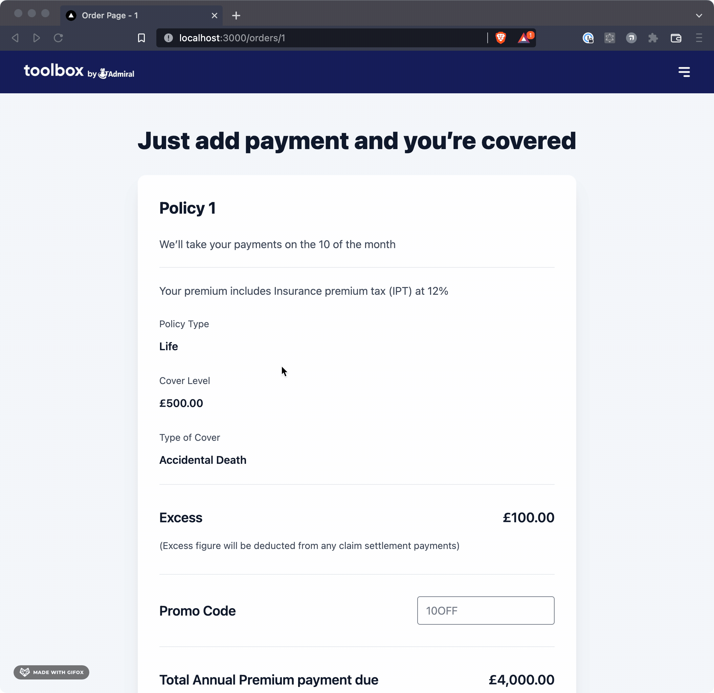
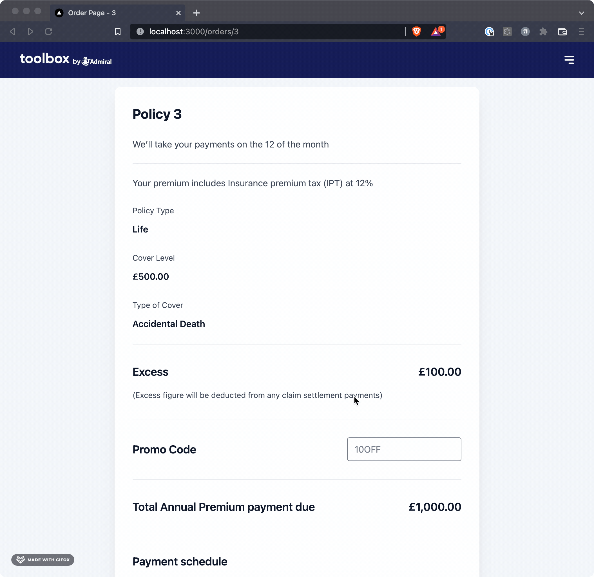

# Toolbox Checkout


Thanks for taking the time to look over my submission for the take home assignment, I hope that this hits the brief and would be happy to discuss the decisions further.

## Getting Started

First, run the development server:

```bash
npm run dev
# or
yarn dev
```

Open [http://localhost:3000](http://localhost:3000) with your browser to see the result.

You should now see a simple page with an input. Enter an number between 1-4 to see the corresponding order.

## Notes

### Available Data

- There are 4 demo orders [1 - 4], you can find them in [mockData/orders](mockData/orders.ts)
- There are also 4 demo discount codes, which you can find here [mockData/discountCodes](mockData/discountCodes.ts)
  - 123
  - 234
  - 345
  - 456

### Promo Code Functionality

On the order page you can use on of the promotional codes and you should see the total re calculated with the discount code.

Each promo code has a usage limit, if you use the same code more than the limit, the discount will not be applied.

Each promo code has a type [percentage, fixed], if the type is percentage, the discount will be applied as a percentage of the total.

The data is stored in memory, so restarting the server will reset the data.

### Storybook

There is a very simple storybook app setup just to showcase how structure of the components can work with storybook.


## Demo

### Payment Modal Demo



### Applying a Promo Code



## Questions / Feedback

If you have any queries or feedback, please feel free to reach out to me mikerudge@me.com
